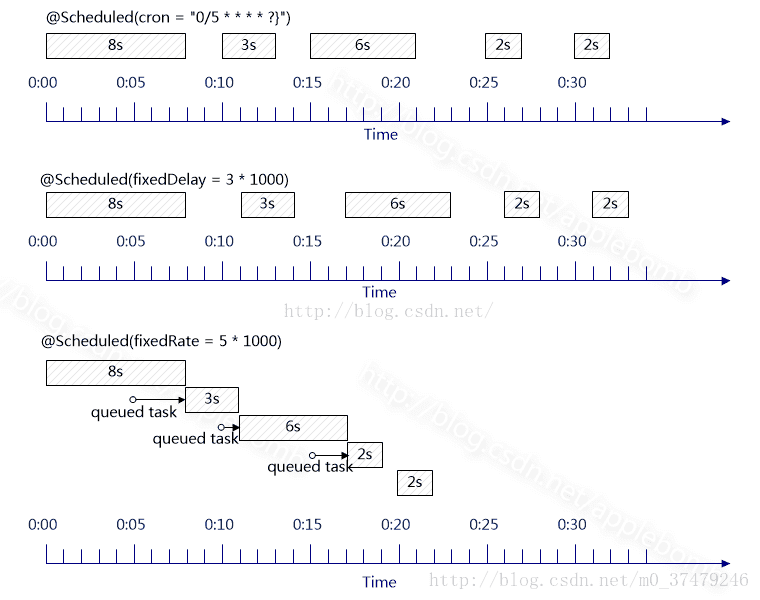

# Spring Quartz

## 一、配置说明

添加task定时任务的xml文件，配置在spring文件中

```xml
<?xml version="1.0" encoding="UTF-8"?>
<beans xmlns="http://www.springframework.org/schema/beans"
       xmlns:xsi="http://www.w3.org/2001/XMLSchema-instance"
       xmlns:context="http://www.springframework.org/schema/context"
       xmlns:task="http://www.springframework.org/schema/task"
       xsi:schemaLocation="http://www.springframework.org/schema/beans 
                            http://www.springframework.org/schema/beans/spring-beans-3.0.xsd 
                            http://www.springframework.org/schema/task 
                            http://www.springframework.org/schema/task/spring-task-3.0.xsd 
                            http://www.springframework.org/schema/context 
                            http://www.springframework.org/schema/context/spring-context-3.0.xsd">
    <context:component-scan base-package="io.itjun.basic.queue.*"/>
    <!--需要扫描的包-->
    <task:annotation-driven/> <!-- 这句是重点 定时器开关-->
</beans>
```

## 二、控制说明

@Scheduled 注解可以控制方法定时执行，其中有三个参数可选择：

1、fixedDelay控制方法执行的间隔时间，是以上一次方法执行完开始算起，如上一次方法执行阻塞住了，那么直到上一次执行完，并间隔给定的时间后，执行下一次。

2、fixedRate是按照一定的速率执行，是从上一次方法执行开始的时间算起，如果上一次方法阻塞住了，下一次也是不会执行，但是在阻塞这段时间内累计应该执行的次数，当不再阻塞时，一下子把这些全部执行掉，而后再按照固定速率继续执行。

3、cron表达式可以定制化执行任务，但是执行的方式是与fixedDelay相近的，也是会按照上一次方法结束时间开始算起。

### 2.1、fixedDelay 

1. 上个任务执行完成以后，休息5秒再开始执行。

2. fixedDelay控制方法执行的间隔时间，**是以上一次方法执行完毕以后开始算起**。
3. 如上一次方法执行阻塞住了，那么直到上一次执行完，并间隔给定的时间后，执行下一次。
4. 查看下列执行结果可以看到下一次的执行开始都是上一次结尾加5秒。

```
8秒
0:start run at 14:38:53
0:end run at 14:39:01

7秒
1:start run at 14:39:06
1:end run at 14:39:13

6秒
2:start run at 14:39:18
2:end run at 14:39:24

3秒
3:start run at 14:39:29
3:end run at 14:39:32

2秒
4:start run at 14:39:37
4:end run at 14:39:39

1秒
5:start run at 14:39:44
5:end run at 14:39:45

1秒
6:start run at 14:39:50
6:end run at 14:39:51

5秒
7:start run at 14:39:56
7:end run at 14:40:01

1秒
8:start run at 14:40:06
8:end run at 14:40:07

1秒
9:start run at 14:40:12
9:end run at 14:40:13

1秒
10:start run at 14:40:18
10:end run at 14:40:19

---------- test end at 14:40:24 ---------
```

### 2.2、fixedRate

1. fixedRate是按照一定的速率执行，**是从上一次方法执行开始的时间算起**。
2. 如果上一次方法阻塞住了，下一次也是不会执行。
3. 但是在阻塞这段时间内**累计应该执行的次数**。
4. 当不再阻塞时，一下子把这些全部执行掉，而后再按照固定速率继续执行。

```
8秒
0:start run at 14:33:37
0:end run at 14:33:45

7秒
1:start run at 14:33:45
1:end run at 14:33:52

6秒
2:start run at 14:33:52
2:end run at 14:33:58

有3个任务因阻塞执行超出

3秒
3:start run at 14:33:58
3:end run at 14:34:01

2秒
4:start run at 14:34:01
4:end run at 14:34:03

1秒
5:start run at 14:34:03
5:end run at 14:34:04

在阻塞执行完后，一次性把积压的时间点直接运行

1秒
6:start run at 14:34:07
6:end run at 14:34:08

5秒
7:start run at 14:34:12
7:end run at 14:34:17

1秒
8:start run at 14:34:17
8:end run at 14:34:18

1秒
9:start run at 14:34:22
9:end run at 14:34:23

1秒
10:start run at 14:34:27
10:end run at 14:34:28

---------- test end at 14:34:32 ---------
```

### 2.3、cron

1. cron表达式可以定制化执行任务，当时间达到设置的时间会触发事件。
2. 但是执行的方式是与fixedDelay相近的。
3. 也是会**按照上一次方法结束时间开始算起**。
4. 上一次执行的时长超过一个间隔，则累计算一次间隔的倍数。

```
8秒
0:start run at 14:43:10
0:end run at 14:43:18

7秒
1:start run at 14:43:20
1:end run at 14:43:27

6秒
2:start run at 14:43:30
2:end run at 14:43:36

3秒
3:start run at 14:43:40
3:end run at 14:43:43

2秒
4:start run at 14:43:45
4:end run at 14:43:47

1秒
5:start run at 14:43:50
5:end run at 14:43:51

1秒
6:start run at 14:43:55
6:end run at 14:43:56

5秒
7:start run at 14:44:00
7:end run at 14:44:05

1秒
8:start run at 14:44:10
8:end run at 14:44:11

1秒
9:start run at 14:44:15
9:end run at 14:44:16

1秒
10:start run at 14:44:20
10:end run at 14:44:21

---------- test end at 14:44:25 ---------
```



